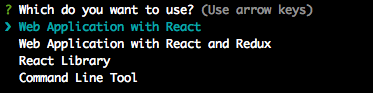

<div align="center">
  <h1>Dish</h1>
</div>

<div align="center">
  <strong>template for frontend application</strong>
</div>

[](https://travis-ci.org/abouthiroppy/dish)
[](https://codecov.io/gh/abouthiroppy/dish)
[]()

## What's Dish?
`dish` command to scaffold complete projects.

## Usage

```shell
$ npm install -g my-dish
$ dish <project-directory>
$ cd <project-directory>
$ enjoy it!
```


## Included templates
- [Web Application with React](./template/react-application)
- [Web Application with React and Redux](./template/react-redux-application)
- [React Library](./template/react-library)
- [Command Line Tool](./template/cli)
- [Plane](./template/plane)

## CHANGELOG
See the [CHANGELOG.md](./CHANGELOG.md).
